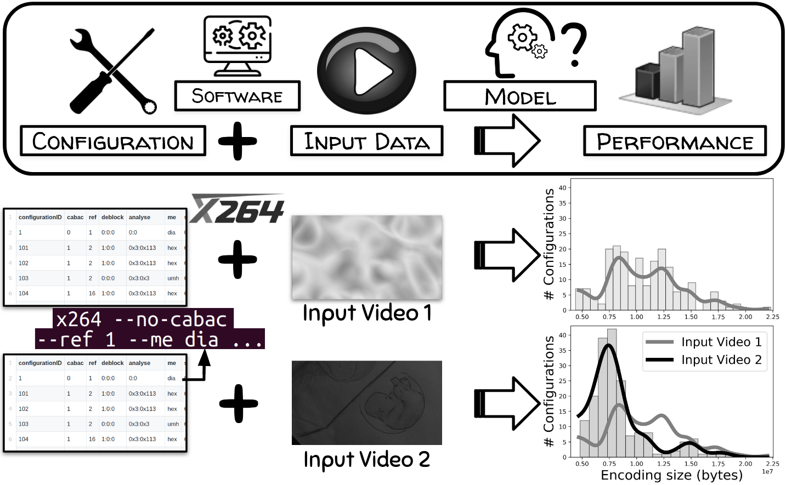

## Learning Input-aware Performance Models of Configurable Systems: An Empirical Evaluation

This is the companion repository of our submission "Learning Input-aware Performance Models of Configurable Systems: An Empirical Evaluation", appeared in [Journal of Systems & Software](https://www.sciencedirect.com/science/article/abs/pii/S0164121223002789) [Preprint](https://hal.science/hal-04271476).

### Organisation

Measurements and details about the performances can be consulted in the **data** folder.

Source code can be consulted in the **src** directory.

The **results** directory contains the results shown in the submission, as well as complementary results.

## In a nutshell

In this paper, we present an empirical evaluation of different learning techniques when predicting the performance properties of software systems according to their configuration and to their input data.

